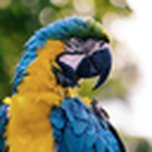
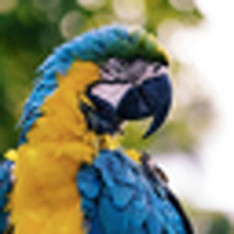
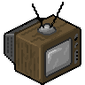

# Scalerack

Many image up- and downscaling algorithms behind one unified interface: classical kernel resampling, edge-aware
reconstruction for crisp low-resolution art, vectorizing and perceptual downscaling approaches. Whatever goes in
comes back out in the same format:

- NumPy arrays: `(H, W)`, `(H, W, 3)`, `(H, W, 4)` in `uint8`, `float32`, `float64`
- Pillow images: `L`, `RGB`, `RGBA`

## Install

```bash
pip install scalerack          # core resampler
pip install scalerack[cli]     # command line interface
pip install scalerack[all]     # everything
```

## Usage

```python
import scalerack

big = scalerack.mitchell(image, factor=2.5)
thumb = scalerack.box(photo, width=320)  # height inferred
crisp = scalerack.magic_kernel_sharp(image, width=100, height=100, version=2021)
sprite = scalerack.scale3x(pil_sprite)  # fixed 3x

# generic dispatch + discovery
out = scalerack.resize("catmull_rom", image, 2)
print(*scalerack.ALGORITHMS)  # all algorithm names
```

Invalid parameters (unsupported factor, wrong input type, missing extra) raise exceptions.

CLI (with the `cli` extra):

```bash
scalerack scale input.png output.png --method lanczos --factor 2
scalerack scale photo.png thumb.png --method box --width 320   # height inferred from aspect ratio
scalerack scale sprite.png big.png --method scale4x --factor 4
scalerack list
```

## Algorithms

Check the code documentation for algorithm details.

### Classical resamplers

Downscale previews are generated as 4x reductions (0.25x output size). Photo reconstruction previews
first degrade the source with Lanczos at 0.25x, then upscale the degraded image back toward the
original size. Sprite upscale previews enlarge the pixel-art source directly.

| Algorithm            | Photo downscale                                                              | Photo reconstruction                                                       | Sprite upscale                                                                                                  |
|----------------------|------------------------------------------------------------------------------|----------------------------------------------------------------------------|-----------------------------------------------------------------------------------------------------------------|
| Original             |            |            |             |
| `nearest`            |             |             |             |
| `box`                |                 |                 |                 |
| `bilinear`           |            |            |            |
| `bicubic`            |             |             |             |
| `mitchell`           |            |            |            |
| `catmull_rom`        |         |         |         |
| `lanczos`            |             |             |             |
| `magic_kernel_sharp` |  |  |  |

### Pixel-art scalers

Some algorithms may output different results depending on the fixed scale factor.

| Algorithm | Photo reconstruction                                             | Sprite upscale                                                                                       |
|-----------|------------------------------------------------------------------|------------------------------------------------------------------------------------------------------|
| Original  |  |  |
| `scale2x` |   |   |
| `scale3x` |   |  |
| `scale4x` |   |  |

Sources: [Münster market](https://commons.wikimedia.org/wiki/File:M%C3%BCnster,_Wochenmarkt_--_2017_--_2333.jpg),
[macaw](https://commons.wikimedia.org/wiki/File%3AMacaw_parrot_%28Unsplash%29.jpg),
and [Pixelart TV](https://commons.wikimedia.org/wiki/File:Pixelart-tv-iso.png), via Wikimedia Commons.

## Roadmap

| Algorithm                                                                           | Family    | Status              |
|-------------------------------------------------------------------------------------|-----------|---------------------|
| nearest, box, bilinear, bicubic, mitchell, catmull_rom, lanczos, magic_kernel_sharp | classical | ✅ implemented       |
| scale2x / scale3x / scale4x (EPX)                                                   | pixel-art | ✅ implemented       |
| hq2x / hq3x / hq4x                                                                  | pixel-art | ⬜ to be implemented |
| xBRZ (2x-6x)                                                                        | pixel-art | ⬜ to be implemented |
| super-xBR                                                                           | pixel-art | ⬜ to be implemented |
| EASU / RCAS (FSR 1 core, CPU)                                                       | extended  | ⬜ to be implemented |
| EWA / Jinc (elliptical weighted average)                                            | extended  | ⬜ to be implemented |
| Gamma-correct (linear-light) resampling                                             | extended  | ⬜ to be implemented |
| Depixelizing Pixel Art (vectorizing)                                                | research  | ⬜ to be implemented |
| Content-adaptive / perceptual / spectral downscaling                                | research  | ⬜ to be implemented |
| Eagle, 2xSaI, SuperEagle, SABR (legacy retro)                                       | contrib   | ⬜ to be implemented |

Machine-learning upscalers are out of scope.

## Development

```bash
uv sync --group dev
uv run pre-commit install                   # ruff check + format on commit
uv run pytest                               # smoke suite
uv run mypy src                             # type check
uv run python scripts/generate_previews.py  # regenerate the gallery above
```

## License

[MIT](LICENSE). All bundled algorithm implementations are original (clean-room from published algorithm
descriptions).
